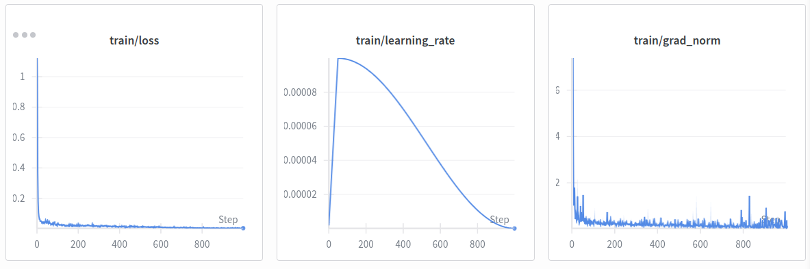

# Setup for GR00T-N1.5 & Trossen Lerobot
## Installing the repo
First, clone the [repository](https://github.com/NVIDIA/Isaac-GR00T/tree/n1.5-release).

```bash
git clone --depth 1 --branch n1.5-release https://github.com/NVIDIA/Isaac-GR00T.git
cd Isaac-GR00T
```

Then create a conda environment for it.

```bash
conda create -n groble python=3.10 -y
conda activate groble
```

First, let's setup the [trossen_lerobot](https://github.com/TrossenRobotics/lerobot_trossen) repo. Then, install the base dependencies. I used `uv` to download all the dependencies.

```bash
git clone https://github.com/TrossenRobotics/lerobot_trossen.git
cd lerobot_trossen && uv pip install -e .
```

```bash
# return to the Isaac-GR00T folder
cd ..
pip install --upgrade setuptools
pip install -e .[base]
```

Now it gets tricky, since my workstation is new--it's gpu architecture is sm120. I uninstall the torch from the dependencies and instead install the nightly build of PyTorch for CUDA 12.8. This step is only done if you have the Blackwell GPUs (check by running, `nvidia-smi -L` in the terminal).
```bash
pip uninstall torch torchvision
pip3 install --pre torch torchvision --index-url https://download.pytorch.org/whl/nightly/cu128
```
Then I install pytorch3d next.
```bash
export TORCH_CUDA_ARCH_LIST="12.0"
pip install --no-build-isolation "git+https://github.com/facebookresearch/pytorch3d.git"
```

Then reinstall the gr00t package, as well as flash-attn.

```bash
pip install -e .[base] --no-deps
pip install --no-build-isolation flash-attn
pip install numpy==1.23.5
```

## Starting Their Demos

They begin with the quick start, where you can download their model checkpoint and run inference via client-server.

```bash
python scripts/inference_service.py --model-path nvidia/GR00T-N1.5-3B --server
```

Open another terminal and start the client. This pulls the model's response (action) from the server after giving it an observation.

```bash
python scripts/inference_service.py  --client
```
### Load the dataset
Next, run the script to load this dataset, which will start a pop-up showing the frames.

```bash
python scripts/load_dataset.py --dataset-path ./demo_data/robot_sim.PickNPlace
```
### Run inference

I installed [TensorRT](https://developer.nvidia.com/tensorrt/download/10x) as a `tar` file.

```bash
version="10.x.x.x"
arch=$(uname -m)
cuda="cuda-x.x"
tar -xzvf TensorRT-10.14.1.48.Linux.x86_64-gnu.cuda-12.9.tar.gz

ls TensorRT-10.14.1.48
export LD_LIBRARY_PATH=TensorRT-10.14.1.48/lib:$LD_LIBRARY_PATH

cd TensorRT-10.14.1.48/python
python3 -m pip install tensorrt-*-cp310-none-linux_x86_64.whl
```

Now deploy the policy... This step is where the trained model is converted to ONNX (Open Neural Network Exchange), optimized with TensorRT, and then run for inference.

```bash
# back in the Isaacc-GR00T folder
python deployment_scripts/export_onnx.py
bash deployment_scripts/build_engine.sh
python deployment_scripts/gr00t_inference.py --inference-mode=tensorrt
```

### Finetune

Run this to fine-tune:

```bash
python scripts/gr00t_finetune.py --dataset-path ./demo_data/robot_sim.PickNPlace --num-gpus 1
```




## Fine-tuning on Our Dataset
GR00T-N1.5 does not have pre-defined configs for robots like the Trossen MobileAI, where it is not a full humanoid yet it has bimanual arms that have end-effector control. Thus, we will have to customize our script.

Let's understand the format of the recorded data first. The Trossen MobileAI records its data in lerobot format, where it outputs `parquet` files containing the robot state and action vectors. Both arms' joints and velocities are already concatenated, with the grippers inside the flattened vector. This means that both arms are logged into one vector.

This is great, because we can treat the action and state as one modality, without need to split it by left or right arms. The format of the dataset is:

```json
# Action (16-D)
0  linear_vel
1  angular_vel
2  left_joint_0
3  left_joint_1
4  left_joint_2
5  left_joint_3
6  left_joint_4
7  left_joint_5
8  left_joint_6
9  right_joint_0
10 right_joint_1
11 right_joint_2
12 right_joint_3
13 right_joint_4
14 right_joint_5
15 right_joint_6

# State (19-D)
0  odom_x
1  odom_y
2  odom_theta
3  linear_vel
4  angular_vel
5–11  left_joint_0 ... left_joint_6
12–18 right_joint_0 ... right_joint_6

# Cameras
observation.images.cam_high
observation.images.cam_left_wrist
observation.images.cam_right_wrist
```

Now here's a problem--like most of the VLAs I've worked with, GR00T-N1.5 has a specific way to read the data, and unfortunately, our dataset isn't fully readable by it yet.

Here are the changes I've done:

- Add a custom config file for the Trossen MobileAI robot to the [data_config.py](https://github.com/lajazz23/MobileAI-GR00TN1.5/blob/main/gr00t/experiment/data_config.py) file.  
    1. As shown above, the cameras are conventionally named "observation.images...", but it must be changed. 
    2. I removed all instances of that, so that only "cam_..." was left. This includes renaming the video folders in the dataset.
    
- Added a `modality.json` file to the `dataset/meta` folder from our dataset. Something like this:
```json
{
  "state": {
    "observation": {
      "start": 0,
      "end": 19,
      "fields": {
        "odom_x": {
          "start": 0,
          "end": 1,
          "dtype": "float32"
        },
        "odom_y": {
          "start": 1,
          "end": 2,
          "dtype": "float32"
        },
        "odom_theta": {
          "start": 2,    
          "end": 3,
          "dtype": "float32",
          "range": [-3.1416, 3.1416]
        },

        "linear_vel": {
          "start": 3,
          "end": 4,
          "dtype": "float32"
        },
        "angular_vel": {
          "start": 4,
          "end": 5,
          "dtype": "float32"
        },

        "left_joint_0": {
          "start": 5,
          "end": 6,
          "dtype": "float32",
          "range": [-3.1416, 3.1416]
        },...
        }
     } 
 },

  "action": {
    "action": {
      "start": 0,
      "end": 16,
      "fields": {
        "linear_vel": {
          "start": 0,
          "end": 1,
          "absolute": true,
          "dtype": "float32"
        },
        "angular_vel": {
          "start": 1,
          "end": 2,
          "absolute": true,
          "dtype": "float32"
        },

        "left_joint_0": {
          "start": 2,
          "end": 3,
          "absolute": true,
          "dtype": "float32",
          "range": [-3.1416, 3.1416]
        },...
          }
     }
},

  "video": {
    "cam_high": {
      "original_key": "cam_high"
    },
    "cam_left_wrist": {
      "original_key": "cam_left_wrist"
    },
    "cam_right_wrist": {
      "original_key": "cam_right_wrist"
    }
  },

  "annotation": {
    "human.task_description": {
      "original_key": "task_index"
    }
  }
}
```

- Must make sure `info.json` matches `modality.json`.


## Deploying on the MobileAI (Software)

Let's now try to work on getting the policy deployed on the actual robot. Since GR00T-N1.5 uses a client-server setup, we need to tweak it to be able to send the inference to the robot configurations.

The documentation mentions 2 client modes--**ZMQ** and **HTTPS**.
- ZMQ is lightweight and fast, making it  good for local network.
- HTTP is better for connecting remotely to the robot.

Let's use ZMQ, since we want to connect to the robot directly.


## Troubleshooting

**Error:** 

```bash
raise InvalidSchemaError from e
pydantic._internal._generate_schema.InvalidSchemaError
```

**Solution:** Ensure `NumPy` is compatabile with `numpydantic` and `Pydantic`. I did the following because I had NumPy v1.26.4.

```bash
# first check your NumPy version
python -c "import numpy; print(numpy.__version__)"

pip install pydantic
pip install --upgrade numpydantic
cd ~/IsaacGR00T 

# rebuild gr00t
pip install -e .[base] --no-deps
```
------------------------------------------------------------------------
**Error:**

```
zmq.error.ZMQError: Address already in use (addr='tcp://*:<port>')
```
**Solution:** Use another port.

```bash
python scripts/inference_service.py --model-path nvidia/GR00T-N1.5-3B --server --port <port>

# You will have to also point the client to the adjusted port
python scripts/inference_service.py --client --port <port>

```
------------------------------------------------------------------------

**Error:**

```bash
RuntimeError: Server error: CUDA error: no kernel image is available for execution on the device
```

**Solution:** Download [pre-built flash-attn wheels](https://github.com/Zarrac/flashattention-blackwell-wheels-whl-ONLY-5090-5080-5070-5060-flash-attention-/releases/tag/FlashAttention).

------------------------------------------------------------------------

**Error:**

```bash
raise ImportError("torchcodec is not available.")
ImportError: torchcodec is not available.
```

**Solution:** My issue was that [torchcodec](https://github.com/meta-pytorch/torchcodec?tab=readme-ov-file#installing-torchcodec) was not compatible with my PyTorch version.

```bash
pip install torchcodec==0.5.0
```

------------------------------------------------------------------------

**Error:** Not enought memory (dependent on size of dataset).

**Solution:** Change the batch size in `Isaac-GR00T/scripts/gr00t_finetune.py` to a smaller number.


----
Made by Jasmin Lin.